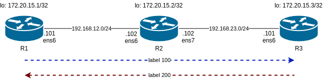
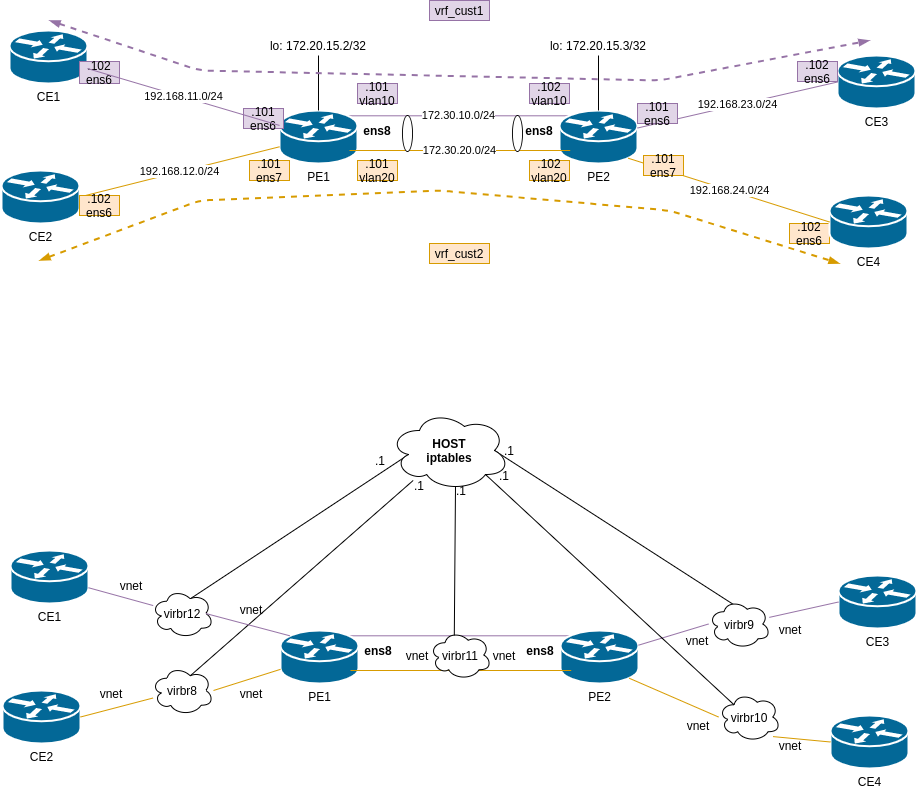
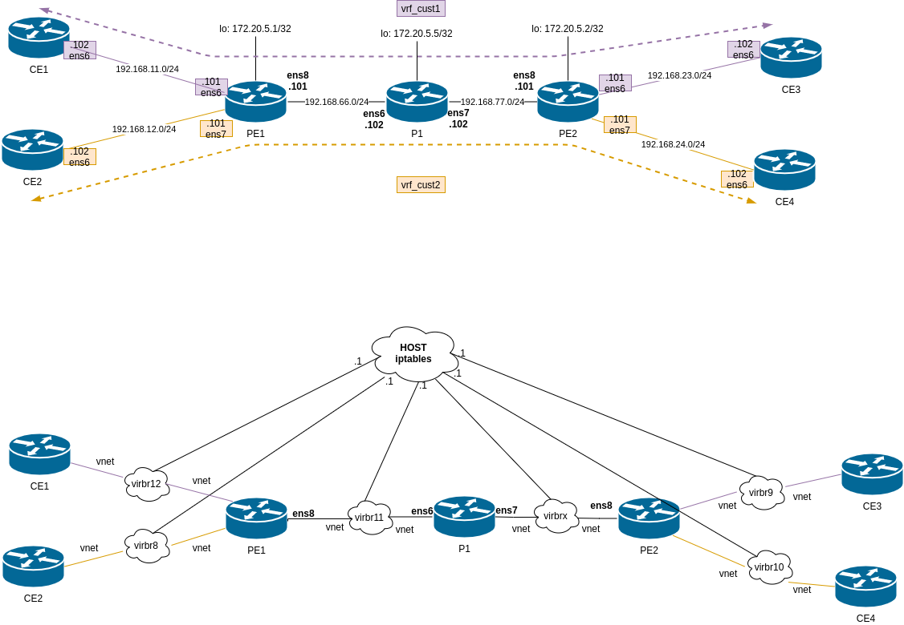

# LINUX + MPLS

Labs for testing MPLS natively in linux - Using vagrant + libvirt + debian10

All credits to http://dvjourney.yman.site/2018/10/26/l3vpn-on-linux/

---

## Part1 - Static LSPs
More details here: https://blog.thomarite.uk/index.php/2021/01/17/linuxmpls-part1/

---

## Part2 - FRR Intro
More details here: https://blog.thomarite.uk/index.php/2021/01/30/linuxmpls-part2/

---

## Part3 - VRF Lite
More details here: https://blog.thomarite.uk/index.php/2021/02/07/linuxmpls-part3/

---

## Part4 - FRR L3VPN
More details here: https://blog.thomarite.uk/index.php/2021/02/27/linuxmpls-part4/

